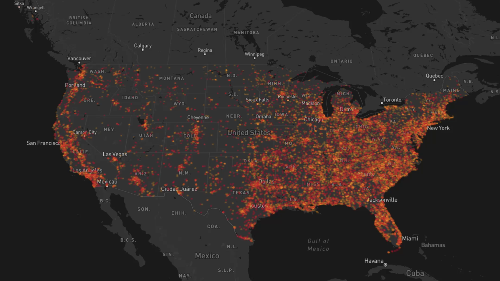

# Interactive Geospatial Dashboard

An interactive web dashboard for exploring geographic patterns in U.S. gun violence incidents.


---

## ⏬ Table of Contents

- [Overview](#overview)
- [Features](#features)
- [Technologies](#technologies)
- [Data](#data)
- [Demo](#demo)
- [Project Structure](#project-structure)
- [How It Works](#how-it-works)

---

## Overview

An interactive geospatial visualization built with **JavaScript, Mapbox, and deck.gl** to explore the geographic distribution and density of gun violence incidents across the United States.

The dashboard allows users to filter incidents by date and switch between multiple geographic visualizations.

---

## Features

| Feature | Description |
|---|---|
|  Interactive Map | Explore incidents across the United States |
|  Date Range | Filter incidents by date |
|  Incidents | View individual incident locations |
|  Density | Identify areas with higher incident concentration |
|  3D Density | Explore geographic density in 3D |
|  Summary Metrics | View total incidents, killed, and injured |

---

## Technologies


<br>


<br>


---

## Data

The dashboard uses incident-level U.S. gun violence data.

Each record represents an individual incident and includes information such as:

- Incident ID
- Date
- Latitude / Longitude
- Number killed
- Number injured
- Location
- Incident categories

The data was retrieved from Kaggle and here is the [link](https://www.kaggle.com/datasets/jameslko/gun-violence-data/data?select=gun-violence-data_01-2013_03-2018.csv).

---

## Demo

### 🎥 Video Demo

[](https://www.youtube.com/watch?v=E6m55ILnQLg)

**▶️ Click the map above to watch the interactive dashboard demo**

The demo shows the dashboard's main features, including date filtering, incident mapping, density visualization, and 3D density visualization.

---

## Project Structure

```text
Interactive-Geospatial-Dashboard/
│
├── index.html
├── gun.js
├── gunData.json
├── styles.css
├── config.js
├── photo/
│   └── cover_gv.png
└── README.md

```
---

## How It Works

The dashboard follows a simple data-to-visualization workflow:

```text
gunData.json
     ↓
Load & Parse Data
     ↓
Date Range Filter
     ↓
Update Dashboard Metrics
     ↓
Update Visualization Layer
     ↓
Scatterplot / Density / 3D Density
```
---

### 1. Load the Data

**Concept:**  
The incident data is loaded from a JSON file and stored in JavaScript arrays.

<details>
<summary>View JavaScript Code</summary>


</details>

---

### 2. Filter By Date

**Concept:**  
When a user selects a date range, the incident data is filtered before the dashboard is updated.

<details>
<summary>View JavaScript Code</summary>


</details>

---

### 3. Load the Data

**Concept:**  
The dashboard dynamically switches between three deck.gl layers based on the selected visualization.

<details>
<summary>View JavaScript Code</summary>


</details>

---

### 4. Calculate Dashboard Metrics

**Concept:**  
The filtered data is also used to dynamically calculate total incidents, deaths, and injuries.

<details>
<summary>View JavaScript Code</summary>


</details>

---

## Author

**Heesoo Kim**  
- Data Analytics | Business Intelligence | Software Development

